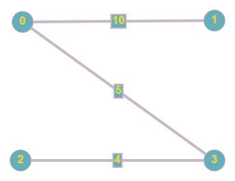
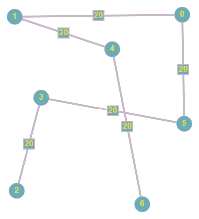

# Kruskal_MST
Use Kruskal algorithm for generating MST.

## Run the script:
```sh
python graph.py
```
## Usage

```python
g = Graph(number_of_vertices)
g.run("\\input\\test.txt")
```

## Description:

There is a given undirected and weighted graph which represents a city.
Each node is represent a number of school aged children in that area.
The weights of the edges are represents the distance between two two node.
The goal is create an MST(Minimum Spanning Tree) to determine where to build
the school in order for the children to travel the least.

Use Kruskal algorithm for generating MST.
Kruskal's algorithm can be shown to run in O(E log E) time, or equivalently, O(E log V) time, 
where E is the number of edges in the graph and V is the number of vertices, all with simple data structures.

## Test Input:

```python
0,1,10
0,2,6
0,3,5
1,3,15
2,3,4
```
## Test Output:

```python
New edge added: u:0, v:1, w:10
New edge added: u:0, v:2, w:6
New edge added: u:0, v:3, w:5
New edge added: u:1, v:3, w:15
New edge added: u:2, v:3, w:4
Constructed Minimum Spanning Tree:
2 -- 3 == 4
0 -- 3 == 5
0 -- 1 == 10
The School has to be built in zone 3
```


### Example for 4 vertices
```python
4
0,1,10
0,2,6
0,3,5
1,3,15
2,3,4
2,1,20
```
 


### Example for 6 vertices
```python
6
1,2,1
1,3,2
1,4,3
1,5,4
2,3,5
2,4,6
2,5,7
0,4,10
5,0,8
```
 


### Example for 7 vertices
```python
7
0,1,20
1,4,20
4,6,20
6,5,20
5,3,20
3,2,20
2,0,20
1,2,20
1,3,20
3,4,20
4,5,20
0,3,20
0,5,20
3,6,20
2,4,20
```
 
